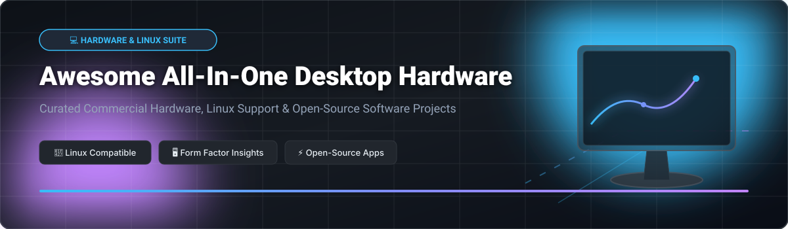

# 💻 Awesome All-In-One Desktop Hardware 🖥️

  
  
  
  

---

## 🚀 Overview & Market Landscape

Welcome to **Awesome All-In-One (AIO) Desktop Hardware** — a curated guide and directory tracking commercial AIO personal computers, OEM hardware certifications, and open-source software projects that unlock their full potential.

### 📊 Market Size & Industry Dynamics
> 💡 **Estimated Market Size & Structure**: The global All-In-One (AIO) PC market is valued at approximately **$28.5 Billion (2025/2026)** and is projected to expand steadily driven by corporate workspace modernization and minimalist home office setups. The sector is **highly concentrated** (dominated by major OEMs such as Apple, HP, Dell, Lenovo, and Microsoft), where top players hold over 80% market share. However, open-source Linux kernel development and community hardware drivers are progressively dismantling proprietary barriers.

---

## 🏢 Commercial Hardware & SaaS Platforms

Below is an overview of key commercial hardware and OEM SaaS/managed solutions supporting All-In-One desktop ecosystems, ranked by company size (valuation/annual revenue).

| Vendor / Product 💻 | Company Size (Revenue / Valuation) 💰 | Starting Price Tier 🏷️ | Free Tier / Trial Limits ⏳ | Linux Compatibility & Highlights 🐧 |
| :--- | :--- | :--- | :--- | :--- |
| **Apple iMac 24-inch M3** | $385.6 Billion (Annual Revenue) | $1,299.00 (Base 8-core GPU model) | 14-Day Free Return & Trial Period (Hardware/AppleCare+ limits) | Minimal boot support expected in Linux Kernel 7.2 (experimental serial console). |
| **Microsoft Surface Studio** | $245.1 Billion (Annual Revenue) | $4,299.99 (Surface Studio 2+ tier) | 30-Day Free Return & Standard Warranty Trial | High Linux compatibility via [`linux-surface`](https://github.com/linux-surface/linux-surface) kernel patches. |
| **Dell Inspiron 27 & EC27250** | $88.4 Billion (Annual Revenue) | $849.99 (Inspiron 27 base tier) | 30-Day Money Back Guarantee & Free Basic Support | Official Ubuntu 24.04 LTS OEM pre-installation & certification options. |
| **Lenovo IdeaCentre & Yoga AIO** | $56.9 Billion (Annual Revenue) | $699.99 (IdeaCentre AIO 3 tier) | 30-Day Free Return Window | Community verified on Kali/Ubuntu; Yoga series requires proprietary Windows drivers. |
| **HP Envy 34 & Pavilion 24** | $53.6 Billion (Annual Revenue) | $1,349.99 (Pavilion AIO 24 tier) | 30-Day Standard Warranty Return Trial | Emerging kernel audio patch (`ALC225_FIXUP_HP_AIO_SPK`); mixed GPU driver support. |
| **ASUS Zen AiO 24** | $16.2 Billion (Annual Revenue) | $799.00 (Zen AiO 24 AMD tier) | 30-Day Hardware Replacement / Return Trial | Standard Windows 11 pre-installed; requires manual Linux driver tweaking. |
| **Acer Aspire C27** | $8.8 Billion (Annual Revenue) | $649.99 (Aspire C27 Intel tier) | 30-Day Manufacturer Trial Support | Certified compatible with Astra Linux Special Edition SE 1.8.4. |
| **MSI Modern AM242** | $6.4 Billion (Annual Revenue) | $549.99 (Barebone / No-OS tier) | 30-Day Return Trial (No OS license fee required) | Excellent for custom Linux setups; ships without pre-installed Windows. |

---

## 🔓 Open-Source Software Projects & Kernel Drivers

Enhance your All-In-One desktop experience with these top open-source projects, utilities, and operating systems. Sorted by GitHub Stars_Count (descending).

-  **[OBS Studio](https://github.com/obsproject/obs-studio)** — Free and open-source software for video recording and live streaming, ideal for high-resolution AIO webcams and display capture.
-  **[Blender](https://github.com/blender/blender)** — Open-source 3D creation suite supporting rendering and animation on touch/stylus-enabled AIO displays (e.g., Surface Studio).
-  **[FreeCAD](https://github.com/FreeCAD/FreeCAD)** — Parametric 3D CAD modeler suited for hardware designers and desktop engineers.
-  **[RetroArch](https://github.com/libretro/RetroArch)** — Cross-platform frontend for emulators, game engines, and media players, perfect for large AIO screens.
-  **[linux-surface](https://github.com/linux-surface/linux-surface)** — Linux kernel driver package providing full hardware support for Microsoft Surface devices, including Surface Studio SAM and touchscreen.
-  **[ONLYOFFICE Desktop Editors](https://github.com/ONLYOFFICE/DesktopEditors)** — Open-source office suite offering seamless document, spreadsheet, and presentation editing locally on Linux desktop AIOs.
-  **[KDE KWin](https://github.com/KDE/kwin)** — Flexible window manager with robust multi-touch and high-DPI scaling support for touchscreen AIO monitors.
-  **[Linux Hardware Database (linuxhw)](https://github.com/linuxhw/Trends)** — Community database collecting hardware probes to verify component compatibility for AIO models prior to installation.

---

## 🛠️ How to Contribute

Contributions are warmly welcome! Help us keep this directory accurate and up to date:
1. 🍴 **Fork** this repository.
2. 📝 Add or update entries in `README.md` following the tabular and star-sorted format.
3. 🔀 Submit a **Pull Request** with a brief summary of hardware/software updates.

---

## ⚠️ Disclaimer

This list is community-curated for informational and research purposes. All product names, logos, and brands are property of their respective owners. Linux support on commercial All-In-One hardware varies significantly by model; always verify driver status before purchasing hardware for open-source environments.

---

## ❤️ Support & Acknowledgments

If you find this repository helpful, please consider supporting the project:
- ⭐ **Star** this repository on GitHub to show your appreciation!
- 🔀 **Fork** and share it with fellow hardware and Linux enthusiasts.
- ☕ **Sponsor / Buy Me a Coffee**: Support ongoing open-source maintenance via [GitHub Sponsors](https://github.com/sponsors/ishandutta2007).

---

## 📈 Star History

